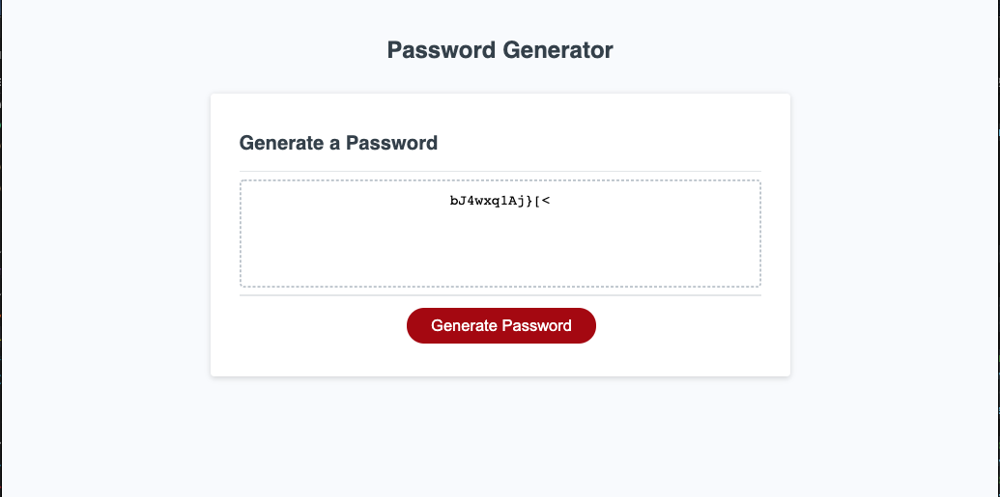

# Password-Generator-Hw-3

# 03 JavaScript: Password Generator

This **project** was assembled to randomly generate a password that meets certain criteria so that the user can create a strong password that provides greater security.

## Preview

> Password Generator Page Example

---

### Website

[Password Generator]

https://sirog-e.github.io/Password-Generator-Hw-3/

---

## Description

The goal was to:
- Get presented with a series of prompts for password criteria when user clicks the button to generate a password.
- To select which criteria to include in the password when prompted for password criteria.
- To choose a length of at least 8 characters, and no more than 128 characters when prompted for the length of the password. 
- To choose lowercase, uppercase, numeric, and/or special characters when prompted for character types to include in the password.
- User input should be validated and at least one character type should be selected when user answers each prompt.
- A password is generated that matches the selected criteria once all prompts are answered.
- The user's new password is written to the page, inside the password Generator Box once the password is generated.

## Review

After completing my javascript for password generator, I was able to build a function that generates multiple passwords as long as user meets the criteria mentioned in the description. Length must be between 8 and 128 characters, must include at least one lowercase letter or uppercase letter, or number or a special character. User may select one or more, or all. 

To complete this project I got help from several sites listed below:

* https://stackoverflow.com/questions/1497481/javascript-password-generator
* https://jsfiddle.net/
* https://www.w3schools.com/js/js_loop_for.asp
* https://jsfiddle.net/b2av54t0/4/

